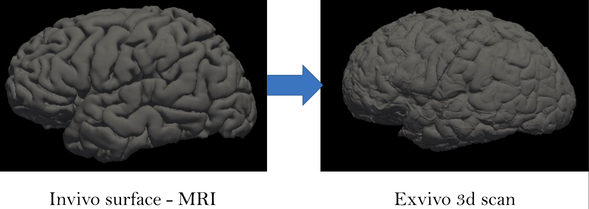
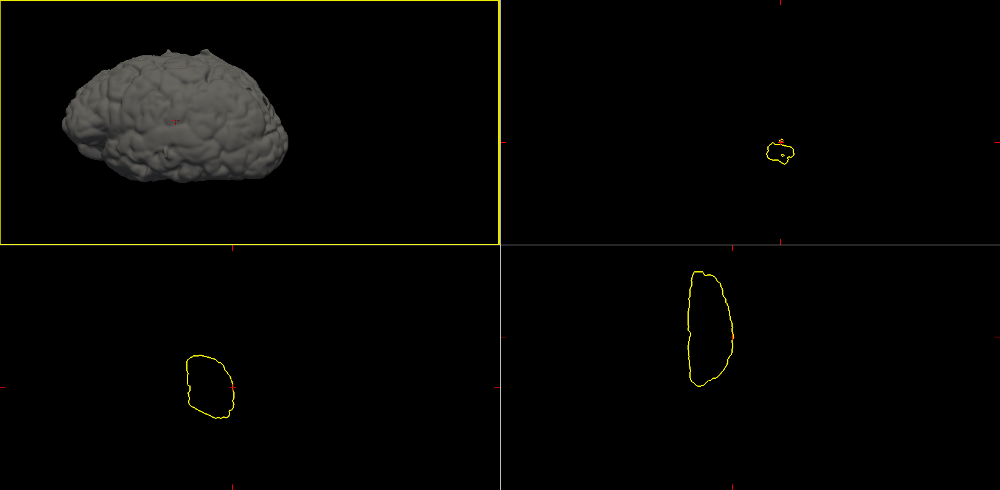

# Exvivo surface mesh reconstruction from in-vivo FreeSurfer meshes



This project aims to reconstruct the exvivo surface meshes of the brain from in-vivo FreeSurfer meshes. 

Our approach consists of:
1. Filling in mesh at high resolution into a 3D Volume
2. Closing the deep sulci of the brain
3. Meshing/Remeshing the 3D Volume using Marching Cubes

---

## Requirements

:warning: Warning: This installation was only tested on `Linux` 

1. [FreeSurfer](https://surfer.nmr.mgh.harvard.edu/fswiki/DownloadAndInstall)
2. `pip`

---

## Setup

```sh
pip install -r requirements.txt
```

---

## Usage

```sh
python closing.py <path-to-configs-file>
```

---

## Getting Started

:warning: Warning: To follow this tutorial you'll need access to our data. If you don't have, contact one of the project members.

### 1. Setup

The fist step is to setup the configs of your transformation. You can define them using a json file. We provided an [example](configs/default.json) as default.

**Config file structure:**

* **input_mesh:** dictionary with input mesh information
  * **path:** path to the original invivo mesh file
  * **resample_nverts:** Number of vertices in the resample
  * **resolution:** volume resolution
  * **filled_mesh (optional):** Pre-computed filled mesh to skip the first step
  * **remesh (optional):** Pre-computed downsample mesh
* **closing:** dictionary with closing parameters
  * **pad:** zero padding size
  * **radius:** closing sphere radius
  * **fill_holes:** boolean to operate fill function after closing
  * **visualization:** boolean to plot central slices of volumes
* **output_dir:** path to save directory
* **verbose:** boolean to print measure of time
* **create_surfaces:** boolean to generate surfaces from closed volume

After defining your config parameters you're ready to run the code.

### 2. Filling in the Mesh into a 3D Volume

The first part of our code uses FreeSurfer to fill in the original surface into a 3D Volume.


### 3. Closing the brain deep sulci

Then, we use the morphological operations (closing) of scikit-image to close the brain deep sulci.


### 4. Meshing/Remeshing the 3D Volume using Marching Cubes

Finally, we our code uses FreeSurfer to get the surface of our volume, and then converts it to our visualization using FreeView.

You can access the files in the selected output directory


*<center>Original invivo surface</center>*


*<center>Transformed exvivo surface</center>*


*<center>Example of Ground-Truth exvivo surface</center>*
